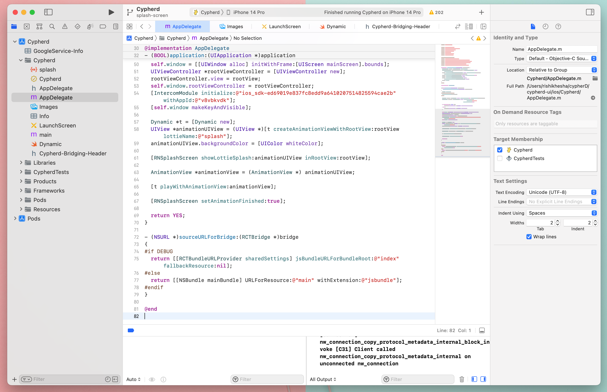
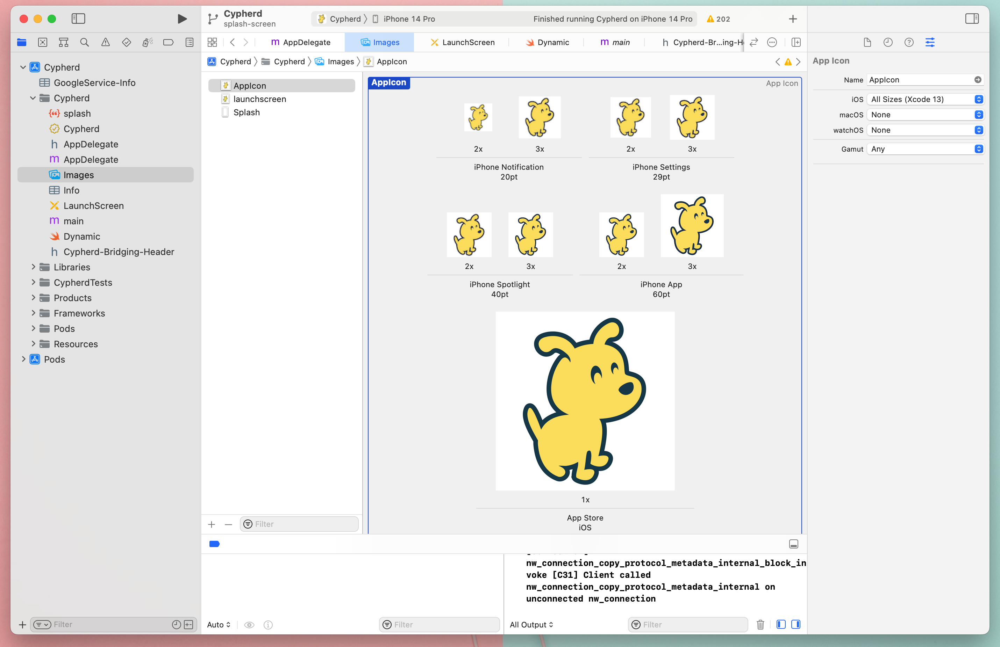
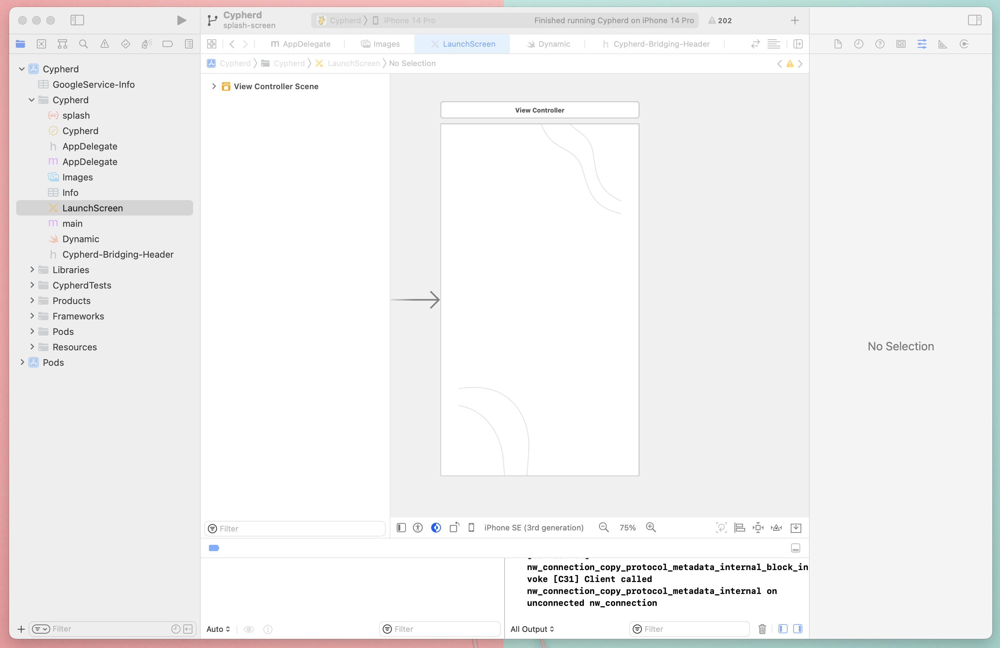

# TAILWIND / NATIVE_WIND
DOCS: https://www.nativewind.dev/

There is no direct support of tailwind css for react-native, so we have used
the native-wind package to bring the support of tailwind into our project.

We have warped the components provided by react-native with a tailwind wrapper and created our 
own components as CyDComponent_name enabling the tailwind properties. To create new components
inside ./src/styles/tailwindStyles.ts we can wrap and create our own components.

<B>How to add default styles the CyD components ?</B>

In ./src/styles/tailwindStyles.ts while wrapping we can provide default styles,
for example export const CyDTextInput = styled(TextInput, 'pb-[0px]');

<B>How to add new configurations like colors, font-family?.</B>

In tailwind.config.js file in root directory inside theme, you can configure
the required fields.

# ADDING ENV VARIABLES

Steps to add environmental variables:
1. Add the variable in .env file in root directory
2. Inside ./src/types/env.d.ts file add the type for the newly added variable
3. Import the variable as import { variable_name } from "@env"
4. Use process.env.APP_ENV to check the current working environment

# CHANGING SPLASH SCREEN
npm package: https://www.npmjs.com/package/react-native-lottie-splash-screen

<B>Changing Lottie File for IOS:</B>

To change the lottie file, 

  1. add the new file inside the CypherD directory
  2. change the file name at line number 58.

<B>Changing AppIcon, Launch screen, Splash screen for IOS:</B>
To change the app icon change the image inside images/AppIcon as shown below, we can also change the launchscreen 
images and splash screen inside the images (only images can be changed, adding lottie here doesn't work here).

If we are using images for launch screen and splash screen, you can edit it via UI in LaunchScreen.storyboard file as shown below

<B>Changing Lottie File for Andriod:</B>

To change the lottie file,

   1. add the new lottie file in andriod/app/src/main/res/raw
   2. change the file name in andriod/app/src/main/res/layout/launch_screen.xml

